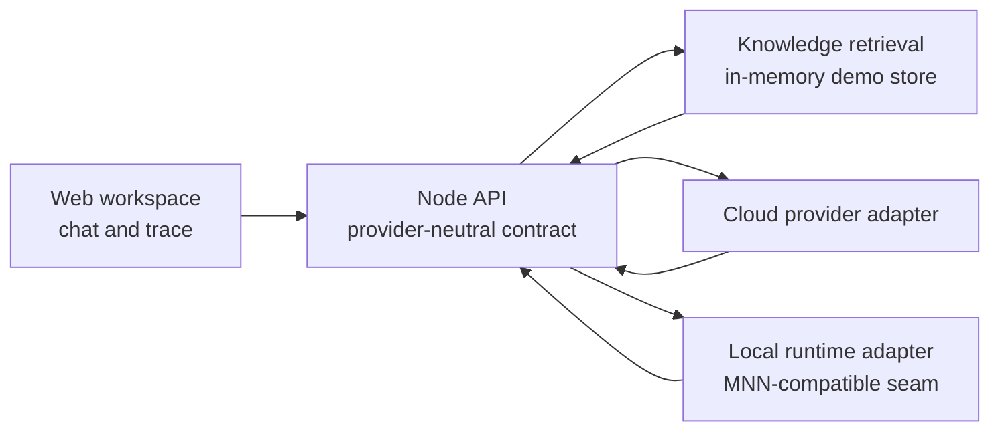

# Signal Copilot

Signal Copilot is a zero-dependency, single-repository AI-native workspace built to demonstrate the product and engineering concerns behind mobile AI applications: a provider-neutral chat contract, local/cloud runtime selection, RAG-style evidence retrieval, workflow traceability, and a small knowledge-ingestion API.

## Why this project

The interface deliberately focuses on a workflow instead of a generic chat clone:

- retrieve workspace evidence before answering;
- expose the retrieval, reranking, tool-planning, and response stages;
- let the same UI select a cloud provider or a local runtime adapter;
- return citations with every answer;
- add knowledge through the backend without changing the frontend contract.

The current response layer is deterministic by design, so the project runs without API keys. Replace `answerFor()` in `server.mjs` with an OpenAI-compatible provider, MNN bridge, or native mobile runtime adapter when integrating a real model.

## Architecture



## Run locally

This project uses only Node.js built-ins.

```bash
npm run dev
```

Open `http://localhost:4173`.

## API surface

| Endpoint | Purpose |
| --- | --- |
| `GET /api/health` | Runtime and workspace health |
| `GET /api/knowledge` | Knowledge cards for retrieval |
| `POST /api/knowledge` | Add a workspace note |
| `POST /api/chat` | Retrieve evidence and return a cited response |

Example chat request:

```json
{
  "query": "How should mobile clients switch between cloud and local inference?",
  "mode": "local"
}
```

## Interview talking points

1. The UI never depends on a particular model provider; it only consumes a stable answer, citations, and run trace.
2. A local runtime is a deployment choice, not a separate product flow. The same run can switch between `cloud` and `local` modes.
3. The project makes RAG inspectable by showing retrieved evidence and the workflow trace alongside the response.
4. The server is intentionally small so it can be replaced by a mobile gateway, a BFF, or a native bridge without rewriting the UI contract.
