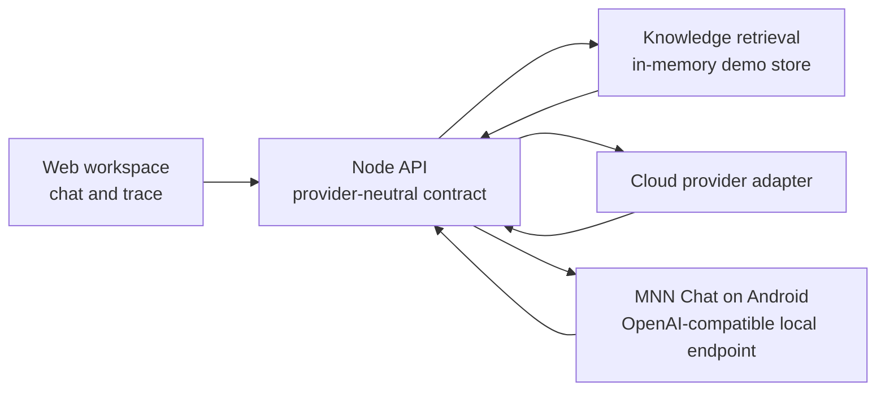

# Signal Copilot

Signal Copilot is a zero-dependency, single-repository AI-native workspace built to demonstrate the product and engineering concerns behind mobile AI applications: a provider-neutral chat contract, local/cloud runtime selection, RAG-style evidence retrieval, workflow traceability, and a small knowledge-ingestion API.

## Why this project

The interface deliberately focuses on a workflow instead of a generic chat clone:

- retrieve workspace evidence before answering;
- expose the retrieval, reranking, tool-planning, and response stages;
- let the same UI select a cloud provider or a local runtime adapter;
- return citations with every answer;
- add knowledge through the backend without changing the frontend contract.

Cloud mode remains deterministic so the project runs without API keys. On-device mode calls a real MNN Chat OpenAI-compatible endpoint when `MNN_BASE_URL` is configured. It fails explicitly when no MNN endpoint is available; it never presents a template response as an on-device model answer.

## Architecture



## Run locally

This project uses only Node.js built-ins.

```bash
npm run dev
```

Open `http://localhost:4173`.

## Run with MNN on-device inference

1. Install or build [MNN Chat](https://github.com/alibaba/MNN/tree/master/apps/Android/MnnLlmChat) on an Android device and download a supported local model.
2. Start its OpenAI-compatible API service and copy its displayed `/v1` base URL.
3. Copy `.env.example` to `.env`, then set `MNN_BASE_URL`, `MNN_API_KEY` if required, and `MNN_MODEL`.
4. Restart `npm run dev`, select **On-device**, and submit a question.

See [MNN local runtime setup](docs/mnn-local-runtime.md) for device-network and error-handling details. The repository deliberately excludes MNN model weights and Android native libraries.

## API surface

| Endpoint | Purpose |
| --- | --- |
| `GET /api/health` | Runtime and workspace health |
| `GET /api/knowledge` | Knowledge cards for retrieval |
| `POST /api/knowledge` | Add a workspace note |
| `POST /api/chat` | Retrieve evidence and return a cited response |

Example chat request:

```json
{
  "query": "How should mobile clients switch between cloud and local inference?",
  "mode": "local"
}
```

## Interview talking points

1. The UI never depends on a particular model provider; it only consumes a stable answer, citations, and run trace.
2. A local runtime is a deployment choice, not a separate product flow. The same run can switch between `cloud` and `local` modes.
3. The project makes RAG inspectable by showing retrieved evidence and the workflow trace alongside the response.
4. Local mode is a real MNN Chat provider integration, not a UI toggle: missing configuration and device failures are surfaced to the user instead of silently falling back to a mock response.
